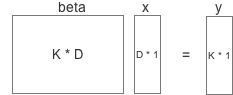

  
# Logistic Regression 逻辑回归
<h2> 一、二元逻辑回归 </h2>  
<ol type="1">
  <li>简介</li>
    回归是解决变量之间的映射关系（x->y），而逻辑回归则通过sigmoid函数将映射值限定在(0,1)。sigmoid图像如下：<br><br>  
 <div align=center>
  
  <a href="https://www.codecogs.com/eqnedit.php?latex=g(z)=\frac{1}{1&plus;e^{-z}}" target="_blank"></a></div><br>
假设特征是x，线性函数可以表示为： <br>
  <div align=center><a href="https://www.codecogs.com/eqnedit.php?latex=z=\beta_{0}&plus;\beta_{1}&space;\mathit{x}_1&plus;\beta_{2}&space;\mathit{x}_2&plus;...&plus;\beta_{n}&space;\mathit{x}_n&space;=\vec{\beta}\vec{x}" target="_blank"></a></div><br>
  而逻辑回归则是在其基础上套上一个sigmoid函数：<br>
  <div align=center>
<a href="https://www.codecogs.com/eqnedit.php?latex=h_{\beta}(x)=g(z)=\frac{1}{1&plus;e^{\vec{\beta}\vec{x}}}" target="_blank"></a>
</div><br>
  因此逻辑回归属于线性函数，具有线性决策边界（面）：
  <div align=center>
  </div>

 对于二分类，分类结果只有两种：y=1 or y=0，其概率分别为 
 <div align=center style="border:3px;margin:10px;"><a href="https://www.codecogs.com/eqnedit.php?latex=P(y=1|\beta&space;)=h_{\beta}(x)=\frac{1}{1&plus;e^{-\vec{\beta}\vec{x}}}" target="_blank"></a> </div><br>
 <div align=center><a href="https://www.codecogs.com/eqnedit.php?latex=P(y=0|\beta&space;)=1-h_{\beta}(x)=\frac{1}{1&plus;e^{\vec{\beta}\vec{x}}}" target="_blank"></a> </div><br>
因此最大似然估计为：
<div align=center style="border:3px;margin:10px;">
<a href="https://www.codecogs.com/eqnedit.php?latex=likelihood&space;=\prod_{i}^{&space;}{p(y=1|\beta&space;))^{y_{i}}p(y=0|\beta&space;))^{1-y_{i}}}" target="_blank"></a>
</div><br>
 对上述公式取log方便计算，同时为了将likelihood最大化问题转化为最小化问题，对上述公式取-log得到损失函数：<br><br>
<div align=center style="border:1px ;width:500px;margin:auto">
<div align=left>
<a href="https://www.codecogs.com/eqnedit.php?latex=loss&space;=-log(likelyhood)" target="_blank"></a><br><br>
<a href="https://www.codecogs.com/eqnedit.php?latex==-\sum&space;y_{i}log(h_{\beta&space;}(x_{i}))&space;&plus;&space;(1-y_{i})log(1-h_{\beta&space;}(x_{i}))" target="_blank"></a><br><br>
<a href="https://www.codecogs.com/eqnedit.php?latex==\sum&space;log(1&plus;e^{-\vec{\beta&space;}\vec{x_{i}&space;}})-(-\vec{\beta&space;}\vec{x_{i}&space;})(1-y_{i})" target="_blank"></a><br><br>
<a href="https://www.codecogs.com/eqnedit.php?latex==\sum&space;log(1&plus;e^{margin})-(1-y_{i})margin" target="_blank"></a><br>
<a href="https://www.codecogs.com/eqnedit.php?latex=margin=-\vec{\beta&space;}\vec{x}" target="_blank"></a>
</div></div><br>
考虑一个样本比较方便，spark中也是这样做的，针对样本i，loss对于参数j的一阶gradient为： <br><br>
<div align=center style="border:3px;margin:10px;">
<a href="https://www.codecogs.com/eqnedit.php?latex=\frac{\partial&space;loss}{\partial&space;\beta&space;_{j}}=(h_{\beta&space;}(x)-y_{i})x_{j}^{(i)}=x_{j}^{(i)}\ast&space;multiplyer" target="_blank"></a><br>
<a href="https://www.codecogs.com/eqnedit.php?latex=multiplier=h_{\beta&space;}(x)-y_{i}" target="_blank"></a>
</div><br>
tips：以上margin和multiplier和spark源码中的变量一致。
<br><br>
 <li>过拟合-正则项</li>
为了减少过拟合，在损失函数中加入正则项，其目的是对参数进行限制，与数据无关。<br><br>
<div align=center style="border:3px;margin:10px;">
<a href="https://www.codecogs.com/eqnedit.php?latex=L_{total}(\beta&space;,x)=L_{model}(\beta&space;,x)&plus;L_{reg}(\beta)" target="_blank"></a></div><br>
常见的正则化手段：L1和L2。L1由于并非处处可导，因此求解需要专门的方法例如OWLQN<br><br>
<div align=center style="border:3px;margin:10px;">
<a href="https://www.codecogs.com/eqnedit.php?latex=L1&space;:&space;L_{reg}(\beta)=\lambda&space;\sum&space;\left&space;|&space;\beta&space;\right&space;|" target="_blank"></a> <br><br>
<a href="https://www.codecogs.com/eqnedit.php?latex=L2&space;:&space;L_{reg}(\beta)=\lambda&space;\sum&space;\beta&space;_{i}^{2}" target="_blank"></a>
</div>
<br><br>
 <li>最优化</li>
lr.regression采用了L-BFGS(L2)和OWLQN(L1)，分别针对L2和L1正则化，具体原理网上资料很多可自行查找
<div align=center>
  </div>
 

</ol>
<h2> 二、多元逻辑回归 </h2> 
<ol type="1">
  <li>概率定义：</li>
    spark2中multinomial逻辑回归采用的是softmax（与spark1.6不完全一致），可参考ufldl(http://ufldl.stanford.edu/tutorial/supervised/SoftmaxRegression/)，类别概率定义为： 
    <div align=center style="border:3px;margin:10px;">
  </div>  
  <div align=center>
  </div><br> 
  
 &nbsp;&nbsp;&nbsp;&nbsp;二元逻辑回归中权重为向量，多元逻辑回归中权重beta为矩阵，相当于多个二元逻辑回归（每个类别/每行）: <div align=center  style="border:3px;margin:10px;">
  </div>  
 
&nbsp;&nbsp;&nbsp;&nbsp;上述模型中的参数可以任意伸缩，即对于任意常数值，都可以被加到所有参数，而每个类别的概率值不发生变化：  <div align=center style="border:3px;margin:10px;">
</div>

<li>损失函数及其导数</li>   
    对于数据中的一个实例instance，损失函数为：<div align=center style="border:3px;margin:10px;">
</div> 
其中，</div> 
<br><br>
 不论SGD,LBFGS还是OWLQN最优化，都需要计算损失函数对参数的一阶导数： 
 <div align=center style="border:3px;margin:10px;">
</div> 
其中，w_i是样本权重（暂时忽略不管）， 而 I_{y=k}：因为对第k个类别的参数beta_k求导，因此只有当前样本的y=k，损失函数的最后一项才计算：

<div align=center style="border:3px;margin:10px;">
</div>
<div align=center>
</div><br>
上述公式中，当max(margin)>0时会导致运算溢出，因此需要一些调整，首先损失函数等价变换：
<div align=center style="border:3px;margin:10px;">
</div>  
进而，multiplier则变成：
<div align=center style="border:3px;margin:10px;">
</div> 

</ol>  


<h2>三.实例</h2> 
```
import org.apache.spark.ml.classification.LogisticRegression

// Load training data
val training = spark.read.format("libsvm").load("data/mllib/sample_libsvm_data.txt")

val lr = new LogisticRegression()
  .setMaxIter(10)
  .setRegParam(0.3)
  .setElasticNetParam(0.8)

// Fit the model
val lrModel = lr.fit(training)

// Print the coefficients and intercept for logistic regression
println(s"Coefficients: ${lrModel.coefficients} Intercept: ${lrModel.intercept}")

// We can also use the multinomial family for binary classification
val mlr = new LogisticRegression()
  .setMaxIter(10)
  .setRegParam(0.3)
  .setElasticNetParam(0.8)
  .setFamily("multinomial")

val mlrModel = mlr.fit(training)

// Print the coefficients and intercepts for logistic regression with multinomial family
println(s"Multinomial coefficients: ${mlrModel.coefficientMatrix}")
println(s"Multinomial intercepts: ${mlrModel.interceptVector}")

//多分类与上述类似，省略
```
 
<h2>四.代码分析</h2>  
<h3>4.1  整体流程</h3>
逻辑回归（mllib/src/main/scala/org/apache/spark/ml/classification/LogisticRegression.scala）的主要代码体现在run函数的 `val (coefficientMatrix, interceptVector, objectiveHistory) = {}` 代码块中。其中前部分初始化参数和计算summary（feature的均值和标准差等），之后则是关键部分：
<div style="text-indent:2em;">
**损失函数costFun和最优化方法optimizer**：
如果不使用L1正则化，则采用LBFGS优化，否则利用OWLQN算法优化（因为L1不保证处处可导），两者都属于拟牛顿法，可参考博客http://www.cnblogs.com/vivounicorn/archive/2012/06/25/2561071.html</div>
    
        val regParamL1 = $(elasticNetParam) * $(regParam)
        val regParamL2 = (1.0 - $(elasticNetParam)) * $(regParam)

        val bcFeaturesStd = instances.context.broadcast(featuresStd)
        
        #损失函数后面定义，其中包括梯度计算。必须定义，breeze/optimize中（LBFGS和OWLQN）会用到
        val costFun = new LogisticCostFun(instances, numClasses, $(fitIntercept),
          $(standardization), bcFeaturesStd, regParamL2, multinomial = isMultinomial,
          $(aggregationDepth))

        val optimizer = if ($(elasticNetParam) == 0.0 || $(regParam) == 0.0) {
          new BreezeLBFGS[BDV[Double]]($(maxIter), 10, $(tol))
        } else {
          val standardizationParam = $(standardization)
          def regParamL1Fun = (index: Int) => {
            // Remove the L1 penalization on the intercept
            val isIntercept = $(fitIntercept) && index >= numFeatures * numCoefficientSets
            if (isIntercept) {
              0.0
            } else {
              if (standardizationParam) {
                regParamL1
              } else {
                val featureIndex = index / numCoefficientSets
                // If `standardization` is false, we still standardize the data
                // to improve the rate of convergence; as a result, we have to
                // perform this reverse standardization by penalizing each component
                // differently to get effectively the same objective function when
                // the training dataset is not standardized.
                if (featuresStd(featureIndex) != 0.0) {
                  regParamL1 / featuresStd(featureIndex)
                } else {
                  0.0
                }
              }
            }
          }
          new BreezeOWLQN[Int, BDV[Double]]($(maxIter), 10, regParamL1Fun, $(tol))
        }
        
        #此处省略 初始化等操作#
        
        #该LogisticRegression类继承了FirstOrderMinimizer，因此使用FirstOrderMinimizer类中的iterations方法
        val states = optimizer.iterations(new CachedDiffFunction(costFun),
          new BDV[Double](initialCoefWithInterceptMatrix.toArray))

        /*
           Note that in Logistic Regression, the objective history (loss + regularization)
           is log-likelihood which is invariant under feature standardization. As a result,
           the objective history from optimizer is the same as the one in the original space.
         */
        val arrayBuilder = mutable.ArrayBuilder.make[Double]
        var state: optimizer.State = null
        #更新到最后一个迭代为最终值
        while (states.hasNext) {
          state = states.next()
          arrayBuilder += state.adjustedValue
        }
        bcFeaturesStd.destroy(blocking = false)
 <div style="text-indent:2em;">
 其中states表示状态迭代器，每个迭代进行更新，state类在breeze/optimize/FirstOrderMinimizer.scala中，包括x模型参数、value模型loss、grad梯度等：</div>
  
    case class State[+T, +ConvergenceInfo, +History](
       x: T,
      value: Double,
      grad: T,
      adjustedValue: Double,
      adjustedGradient: T,
      iter: Int,
      initialAdjVal: Double,
      history: History,
      convergenceInfo: ConvergenceInfo,
      searchFailed: Boolean = false,
      var convergenceReason: Option[ConvergenceReason] = None) {}

<h3>4.2  损失函数类 LogisticCostFun</h3>  
 <div style="text-indent:2em;">
 *作用*：在FirstOrderMinimizer的iterations中更新states时使用calculateObjective方法，其中调用DiffFunction.calculate。而LogisticCostFun则继承DiffFunction并重写calculate方法：计算loss 和 gradient with L2 regularization </div>
   <br>
  
```

/**
 * LogisticCostFun implements Breeze's DiffFunction[T] for a multinomial (softmax) logistic loss
 * function, as used in multi-class classification (it is also used in binary logistic regression).
 * It returns the loss and gradient with L2 regularization at a particular point (coefficients).
 * It's used in Breeze's convex optimization routines.
 */
private class LogisticCostFun(
    instances: RDD[Instance],
    numClasses: Int,
    fitIntercept: Boolean,
    standardization: Boolean,
    bcFeaturesStd: Broadcast[Array[Double]],
    regParamL2: Double,
    multinomial: Boolean,
    aggregationDepth: Int) extends DiffFunction[BDV[Double]] {

  override def calculate(coefficients: BDV[Double]): (Double, BDV[Double]) = {
    val coeffs = Vectors.fromBreeze(coefficients)
    val bcCoeffs = instances.context.broadcast(coeffs)
    val featuresStd = bcFeaturesStd.value
    val numFeatures = featuresStd.length
    val numCoefficientSets = if (multinomial) numClasses else 1
    val numFeaturesPlusIntercept = if (fitIntercept) numFeatures + 1 else numFeatures

    #利用logisticAggregator类分别计算loss和gradient，之后treeAggregate进行add和merge
    val logisticAggregator = {
      val seqOp = (c: LogisticAggregator, instance: Instance) => c.add(instance)
      val combOp = (c1: LogisticAggregator, c2: LogisticAggregator) => c1.merge(c2)

      instances.treeAggregate(
        new LogisticAggregator(bcCoeffs, bcFeaturesStd, numClasses, fitIntercept,
          multinomial)
      )(seqOp, combOp, aggregationDepth)
    }

    val totalGradientMatrix = logisticAggregator.gradient
    val coefMatrix = new DenseMatrix(numCoefficientSets, numFeaturesPlusIntercept, coeffs.toArray)
    // regVal is the sum of coefficients squares excluding intercept for L2 regularization.
    val regVal = if (regParamL2 == 0.0) {
      0.0
    } else {
      var sum = 0.0
      coefMatrix.foreachActive { case (classIndex, featureIndex, value) =>
        // We do not apply regularization to the intercepts
        val isIntercept = fitIntercept && (featureIndex == numFeatures)
        #将L2正则项加入loss和相应梯度
        if (!isIntercept) {
          // The following code will compute the loss of the regularization; also
          // the gradient of the regularization, and add back to totalGradientArray.
          sum += {
            if (standardization) {
              val gradValue = totalGradientMatrix(classIndex, featureIndex)
              totalGradientMatrix.update(classIndex, featureIndex, gradValue + regParamL2 * value)
              value * value
            } else {
              if (featuresStd(featureIndex) != 0.0) {
                // If `standardization` is false, we still standardize the data
                // to improve the rate of convergence; as a result, we have to
                // perform this reverse standardization by penalizing each component
                // differently to get effectively the same objective function when
                // the training dataset is not standardized.
                val temp = value / (featuresStd(featureIndex) * featuresStd(featureIndex))
                val gradValue = totalGradientMatrix(classIndex, featureIndex)
                totalGradientMatrix.update(classIndex, featureIndex, gradValue + regParamL2 * temp)
                value * temp
              } else {
                0.0
              }
            }
          }
        }
      }
      0.5 * regParamL2 * sum
    }
    bcCoeffs.destroy(blocking = false)

    (logisticAggregator.loss + regVal, new BDV(totalGradientMatrix.toArray))
  }

```   
<br>
上述代码主要功能：I. 计算loss和gradient并且合并；II. 计算L2正则项加入loss和相应gradient；III. 对数据进行standardization。<br>
<ol type="I">
  <li>loss和gradient  
    损失和梯度的计算在LogisticAggregator类中，包括binaryUpdateInPlace和multinomialUpdateInPlace，下一节会详细介绍。 </li>
  <li>L2正则项  
  这里要注意两点：（1）loss和gradient中都要加入相应L2；（2）Intercept不需要正则项</li>
  <li>standardization  
  即便我们没有选择standardization，整个计算过程中还是会standardize数据，包括计算LogisticAggregator中计算loss、gradient，这样有利于模型收敛。因此这里需要reverse（有点confused，待后续研究）。</li>
</ol>
<br>
<h3> 4.3   LogisticAggregator </h3>
   <div style="text-indent:2em;">
   该类中包含gradient和loss的计算，以及不同LogisticAggregator之间的合并。而gradient和loss计算又包括两部分二元和多元：binaryUpdateInPlace和multinomialUpdateInPlace</div>
<ol type="1">
  <li> binaryUpdateInPlace：binary逻辑回归</li> <br> 
   
   ``` 
  
  /** Update gradient and loss using binary loss function. */
  private def binaryUpdateInPlace(
      features: Vector,
      weight: Double,
      label: Double): Unit = {

    val localFeaturesStd = bcFeaturesStd.value
    val localCoefficients = bcCoefficients.value
    val localGradientArray = gradientSumArray
    //margin即为公式中的margin
    val margin = - {
      var sum = 0.0
      features.foreachActive { (index, value) =>
        if (localFeaturesStd(index) != 0.0 && value != 0.0) {
          //除以localFeaturesStd进行standardization
          sum += localCoefficients(index) * value / localFeaturesStd(index)
        }
      }
      if (fitIntercept) sum += localCoefficients(numFeaturesPlusIntercept - 1)
      sum
    }
    //同公式中的multiplier
    val multiplier = weight * (1.0 / (1.0 + math.exp(margin)) - label)
    //梯度更新：同样standardization
    features.foreachActive { (index, value) =>
      if (localFeaturesStd(index) != 0.0 && value != 0.0) {
        localGradientArray(index) += multiplier * value / localFeaturesStd(index)
      }
    }

    if (fitIntercept) {
      localGradientArray(numFeaturesPlusIntercept - 1) += multiplier
    }

    if (label > 0) {
      // The following is equivalent to log(1 + exp(margin)) but more numerically stable.
      lossSum += weight * MLUtils.log1pExp(margin)
    } else {
      lossSum += weight * (MLUtils.log1pExp(margin) - margin)
    }
  }
  
   ```
   </li> 

<li> multinomialUpdateInPlace：softmax逻辑回归</li> 
<ol type="a">
<li>首先计算margin以及maxMargin，如公式所述。其中值得注意的是数据进行standardization，以及是否有截距。</li>
<br> 
   
   ``` 
  
  /** Update gradient and loss using multinomial (softmax) loss function. */
  private def multinomialUpdateInPlace(
      features: Vector,
      weight: Double,
      label: Double): Unit = {
    // TODO: use level 2 BLAS operations
    /*
      Note: this can still be used when numClasses = 2 for binary
      logistic regression without pivoting.
     */
    val localFeaturesStd = bcFeaturesStd.value
    val localCoefficients = bcCoefficients.value
    val localGradientArray = gradientSumArray

    // marginOfLabel is margins(label) in the formula
    var marginOfLabel = 0.0
    var maxMargin = Double.NegativeInfinity
    //计算margin，如公式所述
    val margins = new Array[Double](numClasses)
    features.foreachActive { (index, value) =>
      //数据进行standardization
      val stdValue = value / localFeaturesStd(index)
      var j = 0
      while (j < numClasses) {
        margins(j) += localCoefficients(index * numClasses + j) * stdValue
        j += 1
      }
    }
    var i = 0
    while (i < numClasses) {
      if (fitIntercept) {
        margins(i) += localCoefficients(numClasses * numFeatures + i)
      }
      if (i == label.toInt) marginOfLabel = margins(i)
      //计算maxMargin
      if (margins(i) > maxMargin) {
        maxMargin = margins(i)
      }
      i += 1
    }  
   ```
  <br>
<li>multiplier,gradient,loss
<div style="text-indent:2em;">
下面计算multiplier，gradient和loss：其中margin统一减去maxMargin以免计算爆炸，同时数据要进行standardization。 
  
  其中margin和multiplier是数组，维度取决于类别数，即对于每个类别k来说就是一个浮点数；而localGradientArray则是一个矩阵（这里将矩阵平铺成数组）。 </div> 
  
tips：可以看成K个binary回归，分别计算margin，multiplier和gradient；一条样本，同时计算所有参数梯度localGradientArray。</li>
<br> 
   
   ``` 
  
    /**
     * When maxMargin is greater than 0, the original formula could cause overflow.
     * We address this by subtracting maxMargin from all the margins, so it's guaranteed
     * that all of the new margins will be smaller than zero to prevent arithmetic overflow.
     */
    val multipliers = new Array[Double](numClasses)
    val sum = {
      var temp = 0.0
      var i = 0
      while (i < numClasses) {
        if (maxMargin > 0) margins(i) -= maxMargin
        val exp = math.exp(margins(i))
        temp += exp
        multipliers(i) = exp
        i += 1
      }
      temp
    }

    margins.indices.foreach { i =>
      multipliers(i) = multipliers(i) / sum - (if (label == i) 1.0 else 0.0)
    }
    features.foreachActive { (index, value) =>
      if (localFeaturesStd(index) != 0.0 && value != 0.0) {
        val stdValue = value / localFeaturesStd(index)
        var j = 0
        while (j < numClasses) {
          localGradientArray(index * numClasses + j) +=
            weight * multipliers(j) * stdValue
          j += 1
        }
      }
    }
    if (fitIntercept) {
      var i = 0
      while (i < numClasses) {
        localGradientArray(numFeatures * numClasses + i) += weight * multipliers(i)
        i += 1
      }
    }

    val loss = if (maxMargin > 0) {
      math.log(sum) - marginOfLabel + maxMargin
    } else {
      math.log(sum) - marginOfLabel
    }
    lossSum += weight * loss
  }  
   ```
  </ol>
   </li>
</ol> 
<h3>4.4   最优化方法（/breeze/optimize/）</h3>
   <div style="text-indent:2em;">
   在LogisticCostFun中只计算了参数的一阶导数gradient，然而源码中用的最优化方法是LBFGS和OWLQN（解决L1-norm不可微），因此只有gradient是不够的。最优化的重点在于确定参数的更新方向和步长。</div>  
   <div style="text-indent:2em;">
   FirstOrderMinimizer中声明了（1）海塞阵估计方法History（2）参数更新方向chooseDescentDirection（3）步长determineStepSize。在iterations中更新states时要用到上述三个重要模块，具体的定义则在相应的最优化方法中。</div>
   <ol>
<li> LBFGS (breeze/optimize/LBFGS.scala)<br>
   <ol type="i">
   <li>还塞矩阵估计方法：`type History = LBFGS.ApproximateInverseHessian[T]`</li><br>
   <li> chooseDescentDirection：迭代方向，海塞阵*梯度<br><br>
```
protected def chooseDescentDirection(state: State, fn: DiffFunction[T]): T = {
    state.history * state.grad
  }
```</li><br>
  <li> determineStepSize：一维搜索，寻找最佳步长，具体原理此处省略


```

/**
   * Given a direction, perform a line search to find
   * a step size to descend. The result fulfills the wolfe conditions.
   *
   * @param state the current state
   * @param f The objective
   * @param dir The step direction
   * @return stepSize
   */
  protected def determineStepSize(state: State, f: DiffFunction[T], dir: T) = {
    val x = state.x
    val grad = state.grad

    val ff = LineSearch.functionFromSearchDirection(f, x, dir)
    val search = new StrongWolfeLineSearch(maxZoomIter = 10, maxLineSearchIter = 10) // TODO: Need good default values here.
    val alpha = search.minimize(ff, if (state.iter == 0.0) 1.0 / norm(dir) else 1.0)

    if (alpha * norm(grad) < 1E-10)
      throw new StepSizeUnderflow
    alpha
  }
```
  </li>
   </ol>
   </li>
<li> OWLQN (breeze/optimize/OWLQN)，继承了LBFGS<br>
   <ol type="i">
   <li>还塞矩阵估计方法：继承了LBFGS的history，因为L1-norm的存在与否不影响Hessian矩阵的估计。</li><br>
   <li> chooseDescentDirection：继承了LBFGS，同时相应调整方向，解决L1不可导（可参考OWLQN原理，次梯度）<br>


```
override protected def chooseDescentDirection(state: State, fn: DiffFunction[T]) = {
    val descentDir = super.chooseDescentDirection(state.copy(grad = state.adjustedGradient), fn)

    // The original paper requires that the descent direction be corrected to be
    // in the same directional (within the same hypercube) as the adjusted gradient for proof.
    // Although this doesn't seem to affect the outcome that much in most of cases, there are some cases
    // where the algorithm won't converge (confirmed with the author, Galen Andrew).
    val correctedDir = space.zipMapValues.map(descentDir, state.adjustedGradient, {
      case (d, g) => if (d * g < 0) d else 0.0
    })

    correctedDir
  }
  }
```

</li><br>
<li> determineStepSize：一维搜索，寻找最佳步长，此处感觉和原理不大一样（需要进一步研究）


```

override protected def determineStepSize(state: State, f: DiffFunction[T], dir: T) = {
    val iter = state.iter

    val normGradInDir = {
      val possibleNorm = dir.dot(state.grad)
//      if (possibleNorm > 0) { // hill climbing is not what we want. Bad LBFGS.
//        logger.warn("Direction of positive gradient chosen!")
//        logger.warn("Direction is:" + possibleNorm)
//        Reverse the direction, clearly it's a bad idea to go up
//        dir *= -1.0
//        dir dot state.grad
//      } else {
      possibleNorm
//      }
    }
    
```
</li>
<li> takeStep：OWLQN的takeStep更为复杂，因为要保证迭代前后处于同一象限（更新前权重与更新后权重同方向）


```

// projects x to be on the same orthant as y
  // this basically requires that x'_i = x_i if sign(x_i) == sign(y_i), and 0 otherwise.

  override protected def takeStep(state: State, dir: T, stepSize: Double) = {
    val stepped = state.x + dir * stepSize
    val orthant = computeOrthant(state.x, state.adjustedGradient)
    space.zipMapValues.map(stepped, orthant, {
      case (v, ov) =>
        v * I(math.signum(v) == math.signum(ov))
    })
  }
    
```
</li>

   </ol>
   </li>

   </ol>
<h3>参考文献</h3>
<a href="http://ufldl.stanford.edu/tutorial/supervised/SoftmaxRegression/">【1】ufldl-SoftmaxRegression</a><br>
<a href="http://www.cnblogs.com/vivounicorn/archive/2012/06/25/2561071.html">【2】博客OWLQN</a>