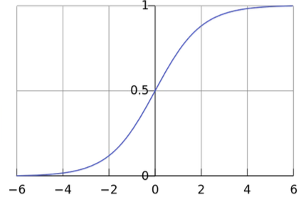
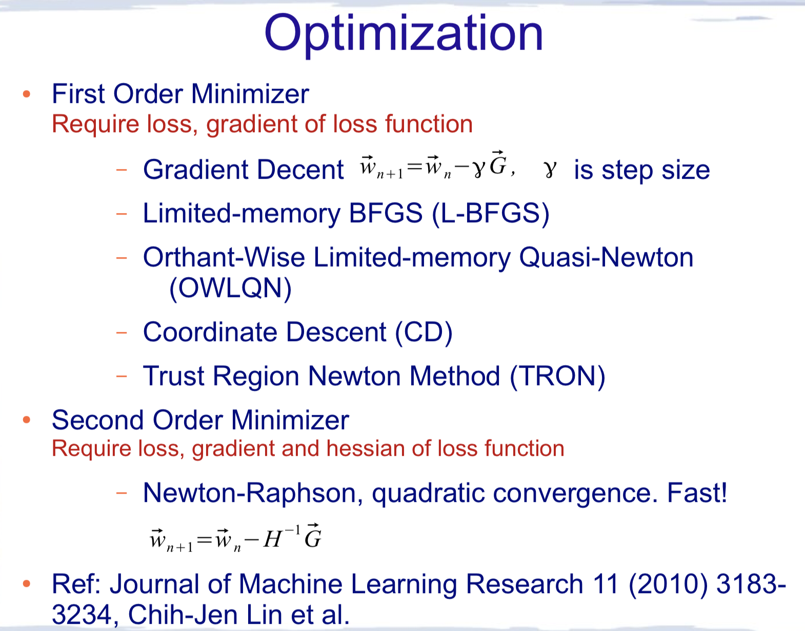
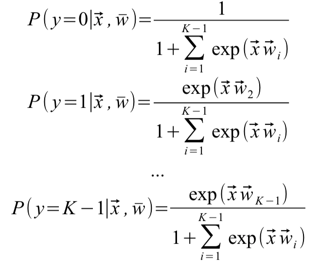

  
# Logistic Regression 逻辑回归
## 1.二元逻辑回归   
(1)回归是解决变量之间的映射关系（x->y），而逻辑回归则通过sigmoid函数将映射值限定在(0,1)。sigmod函数如下：  
 
 <!--  -->
 

假设特征是x，参数xita，线性函数可以表示为：1.3，而逻辑回归则是在其基础上套上一个逻辑函数（sigmoid）：1.4 
  
  逻辑回归属于线性函数，具有线性决策边界（面）：
<!-- -->
 
 对于二分类，分类结果只有两种：y=1 or y=0，另y=1的概率为：1.5，y=0概率则为：1.5 。 
根据数据X=(x1,x3,...,xn),Y=(y1,y2,...,yn)定义最大似然估计：1.6 ，目的是找到使得likelihood最大化的参数xita，因此对其取log（可以-log最小化，此处未-）：1.6，一阶gradient为：1.7，二阶梯度hessian为：1.8 
 
（2）最优化：
 ml.regression采用了L-BFGS(L2)和OWLQN(L1)
 
(3)为了减少过拟合，加入正则项，损失函数变为:1.9
## 2.多元逻辑回归  
 （1）多元回归类似softmax，类别概率定义为：  
   
二元逻辑回归中权重w为向量，二多元逻辑回归中W为权重矩阵，相当于多个二元逻辑回归（每个类别/每行） 
   
（2）log损失函数则为：
对参数矩阵求导，其实是对每个类别的w分别求导： 
 
求导，alpha从公式角度限定是否是第一个类别，kexi根据是否正在计算某个类别的w（某行的w）来限定是否计算第一项：2.1

## 3.实例 
 
## 4.代码分析  
### 4.1  
逻辑回归（mllib/src/main/scala/org/apache/spark/ml/classification/LogisticRegression.scala）的主要代码体现在run函数的 `val (coefficientMatrix, interceptVector, objectiveHistory) = {}` 代码块中。
 
 类LogisticAggregator中，包括binaryUpdateInPlace和multinomialUpdateInPlace