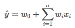
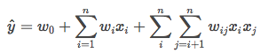
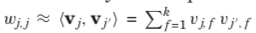
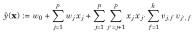
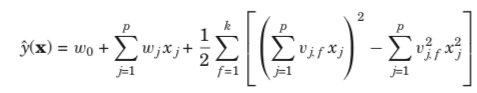
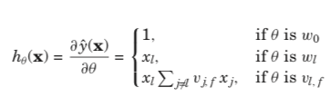
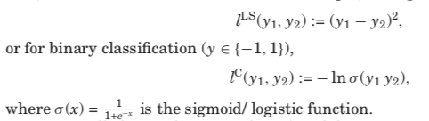
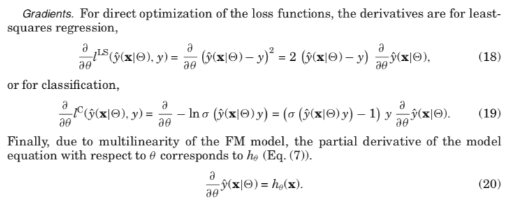
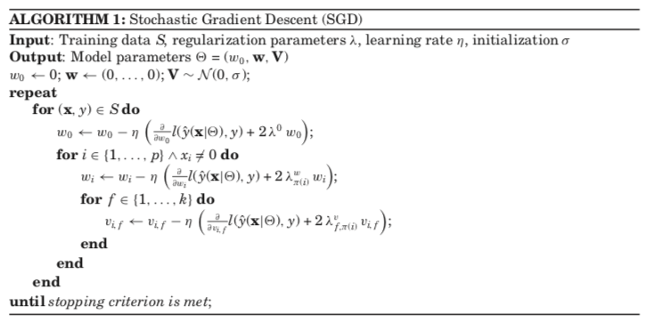

<h1 align="center">Factorization Machines with libFM</h1>
<h2>引入</h2>

基础的线性模型如下，多个单特征的加权 

不难看出，上述模型没有考虑特征的组合，假设特征onehot之后<code>x1</code>表示理科，<code>x2</code>表示文科，<code>x3</code>表示男，<code>x4</code>表示女。那么特征组合<code>x1x3</code>,<code>x2x4</code>可能就是比较有用的特征。因此可以穷举所有可能的特征组合，当然有些组合可能没用，那么模型学习到的系数就会接近于0 。

此处指考虑特征之间的两两组合，因为特征增加参数将指数增加，很难分析。

<h2>一、公式推导</h2>
<ol type="1">
  

此处公式推导完全引用自文献 <a herf="http://doi.acm.org/10.1145/2168752.2168771">Factorization Machines with libFM</a>，其中加入一些自己的理解。上述公式中的n表示特征数量，以下将用p代替。
 
<li>预测值\hat{y}简化</li>

在前面特征组合的公式中，参数w是p•p的矩阵，但其实肯定是非常稀疏的，因为特征组合中有用的不多。为了降低参数规模，采用矩阵分解的方法其中k远小于p，因此参数规模由p•p，变成了p•k，即每个<code>特征</code>对应一个参数向量<code>v[k]</code>。

参数替换后，y的预测值变为

上述公式的复杂度为k•p•p，经过公式化简后，可以减少复杂度，推导结果如下

转化为了<strong>平方和</strong>以及<strong>和的平方</strong>，因此复杂度降低为<strong>k•p</strong>。附上我手推该公式的过程：

<li>参数求导</li>

上述\hat{y}对各个参数的导数如下，比较简单直接给出结果

<li>损失函数loss</li>

根据任务不同，损失函数也会有所不同，主要介绍两种：解决回归问题的最小二乘损失，以及解决二分类的最大似然估计(取-log)。二分类与logistic regression类似，只不过线性函数中增加了特征组合部分。logistic regression的介绍和公式推导可以参考我的上一篇<a href="https://github.com/Demmon-tju/spark-ml-source-mark/blob/master/ml/classification/logistic%20regression/Logistic%20Regression%20逻辑回归.md">文章</a>

由于此处将负样本定为<strong>-1</strong>，而不是0，因此二分类公式形式与我手推的最大似然公式略有不同，但其实只是换个表达形式而已。下面附上在LR和FM的loss和gradient公式上的对比（手写公式，比较懒。。。）：

<li>损失函数求导</li>

对最小二乘和二分类的求导结果如下：其中y就是label，放在sigmoid函数中，巧妙的改变公式的形式

最小二乘求导比较好理解，二分类的导数由于负样本-1的缘故，与我手推公式略有差距，但是原理其实一样，只不过我手推公式中与<a href="https://github.com/Demmon-tju/spark-ml-source-mark/blob/master/ml/classification/logistic%20regression/Logistic%20Regression%20逻辑回归.md">logistic regression</a>形式保持一致。

<li>最优化</li>
<ol type="I">
<li>Stochastic gradient descent (SGD)</li>

最常用的最优化随机梯度下降 SGD：每次迭代中，针对每个样本更新参数

未完待续。

</ol>
</ol>
<h2>二、代码开发</h2>
<h2>参考文献</h2>