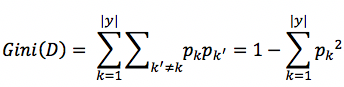
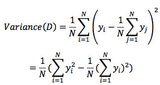
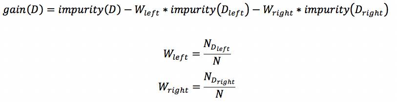

<h1 align="center">决策树 decision tree</h1>
<h2>一、简介</h2>

决策树由节点和边构成，节点分为：内部节点和叶节点，其中内部节点表示一个特征，而叶节点表示一个分类，如下图 

决策树，也可以看成是If Then规则，每个实例都会覆盖其中一条路径（或规则）。

<h2>二、树的构造</h2>

决策树的本质就是根据数据，归纳出一套分类规则，与数据矛盾最小的规则。从所有可能的决策树中，找到最优决策树是NP完全问题，因此通常采用启发式方法，近似求解。 通常就是递归的对特征进行分割，也就是对特征区间进行划分。

<pre><code>
决策树生成算法

输入：训练数据集D，特征集合A
输出：决策树T
（1）如果D中所有实例都属于同一个类C_k，则T为单节点树，并将C_k作为该节点的类，返回T；
（2）如果A为空，则置T为单节点树，并将D中实例数最多的类C_k作为该节点的类，返回T；
（3）否则，从A中选择<strong>最优划分</strong>属性A_g，该属性有若干取值；
（4）根据最优属性A_g及其若干取值，<strong>将该节点分割成若干子节点</strong>：即将D分割构成若干子集D_i，返回由该节点及其子节点构成的树T；
（5）对子节点，以D_i为训练集合，A-A_g为特征集合（也可以A），递归调用（1）-（4）
</code></pre>

上述算法只是决策树的大致生成流程，其中两个最重要的两个问题需要解决：1.最优划分属性的划分标准；2.如何分裂该属性构成若干子节点

<h3>1、如何分裂属性</h3>

分裂属性：根据属性的不同取值，将该属性分裂成若干子集，构成子节点。如何选择最优属性以及分裂值在下一节介绍，此处主要关注如何划分子集构成子节点。

（1）离散属性
<ol type="I">
<li>二叉树：假设a_i为该属性的一个子集，那么可以按照“属于该子集”和“不属于该子集”进行划分。例如该属性代表王者荣耀等级，那么a_i可以是集合“最强王者”，那么划分原则就是“王者”和“非王者”，两个子集</li>
<li>非二叉树：属性的每个取值为一个子集，进行划分。仍以上述王者荣耀为例，可以划分成如下子集：“青铜”集合，“白银”集合，“黄金”集合 等等，构造多个子节点。</li>
</ol>
（2）连续属性

根据最优分裂值split_point，划分为两个分支：值>split_point的分支 和 值<=split_point的分支。

<h3>2、最优划分属性和分裂值</h3>

选择最优属性的原则是使得节点包含的实例尽可能属于同一类，即使得节点不纯度（impurity）尽可能小。在saprk的ml中实现了三种impurity的度量方法：信息熵Entropy、基尼系数Gini、方差Variance。其中Entropy和Gini用来处理离散值，即处理分类问题，而Variance用来处理连续值，即回归。

<h4>2.1 Entropy 信息熵</h4>

信息熵是度量集合中样本不纯度的一种指标，假设当前集合为D，其中样本类别数为|y|，第k类样本所占的比例为p_k，那么集合D的信息熵Entropy则定义为：

Entropy(D)代表不纯度，值越小，不纯度越低。在spark中的源码位于org.apache.spark.mllib.tree.impurity.Entropy
<pre><code>

/**
   * :: DeveloperApi ::
   * information calculation for multiclass classification
   * @param counts Array[Double] with counts for each label
   * @param totalCount sum of counts for all labels
   * @return information value, or 0 if totalCount = 0
   */
  @Since("1.1.0")
  @DeveloperApi
  override def calculate(counts: Array[Double], totalCount: Double): Double = {
    if (totalCount == 0) {
      return 0
    }
    val numClasses = counts.length
    var impurity = 0.0
    var classIndex = 0
    while (classIndex < numClasses) {
      val classCount = counts(classIndex)
      if (classCount != 0) {
        //freq 即为公式中的 p_k
        val freq = classCount / totalCount
        //impurity 即为 Entropy(D)
        impurity -= freq * log2(freq)
      }
      classIndex += 1
    }
    impurity
  }

</code></pre>

<h4>2.2 Gini 基尼系数</h4>

基尼系数也是衡量集合中样本不纯度的一种指标，假设当前集合为D，其中样本类别数为|y|，第k类样本所占的比例为p_k，那么集合D的基尼系数Gini则定义为：

与Entropy类似，Gini(D)代表不纯度，值越小，不纯度越低。直观理解：任取两个样本不相同的概率，越小越纯。spark中的实现位于org.apache.spark.mllib.tree.impurity.Gini
<pre><code>

/**
   * :: DeveloperApi ::
   * information calculation for multiclass classification
   * @param counts Array[Double] with counts for each label
   * @param totalCount sum of counts for all labels
   * @return information value, or 0 if totalCount = 0
   */
  @Since("1.1.0")
  @DeveloperApi
  override def calculate(counts: Array[Double], totalCount: Double): Double = {
    if (totalCount == 0) {
      return 0
    }
    val numClasses = counts.length
    var impurity = 1.0
    var classIndex = 0
    while (classIndex < numClasses) {
      //freq为上述公式中的p_k
      val freq = counts(classIndex) / totalCount
      //gini=1-Sum(freq * freq)
      impurity -= freq * freq
      classIndex += 1
    }
    impurity
  }

</code></pre>
<h4>2.3 Variance 方差</h4>

Variance方差也是衡量集合中样本不纯度的一种指标，因为只是针对连续值，因此只能用于处理回归决策树。假设当前集合为D，样本数量为N，每个样本的值为y_i，那么集合D的Variance方差则定义为：最后转化为平方和以及和的平方

回归决策树中，将节点中包含的所有样本y_i的平均值作为该节点的预测值。该公式直接表示集合D的方差，因此代表该节点预测值与真实值（所有样本）的差距，也就是不纯度impurity。
spark中的实现位于org.apache.spark.mllib.tree.impurity.Variance
<pre><code>

   * :: DeveloperApi ::
   * variance calculation
   * @param count number of instances
   * @param sum sum of labels
   * @param sumSquares summation of squares of the labels
   * @return information value, or 0 if count = 0
   */
  @Since("1.0.0")
  @DeveloperApi
  override def calculate(count: Double, sum: Double, sumSquares: Double): Double = {
    if (count == 0) {
      return 0
    }
    val squaredLoss = sumSquares - (sum * sum) / count
    squaredLoss / count
  }

</code></pre>

<h4>2.4 信息增益</h4>

在决策树中，信息增益(informatioin gain, IG)指根据某个特征进行分裂时，不确定性减少的程度，即不纯度下降的程度。对于二叉决策树，该节点根据某个特征进行分裂成左右两个子节点，那么怎么衡量分裂的好坏呢，怎么找到最好的分裂特征呢？根据IG原理：选择使信息增益最大的特征f进行分裂，即使不纯度下降的最多的特征。

上述 2.1-2.3 都是描述数据的不纯度指标，用impurity表示，都可以用来计算信息增益，在spark中也是这么做的：

根据上述公式，遍历每个特征f及其每个分割值，找到使得gain最大的特征和相应分裂值，即为最优分裂特征和最优分裂值。

<h4>注：</h4>
<strong>此处只对决策树进行了理论介绍，许多实现细节还未介绍：例如关于如何根据特征划分成不同的子节点，连续值和离散值处理的不同点等。 
spark中决策树的具体实现细节和trick在随机森林randomforest中，决策树作为随机森林的一个特例(树数量=1)，因此具体代码和详细内容将在下一篇<a href="https://github.com/Demmon-tju/spark-ml-source-mark/blob/master/ml/tree/random_forest.md">random forest</a>中进行介绍<strong>

              