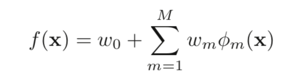
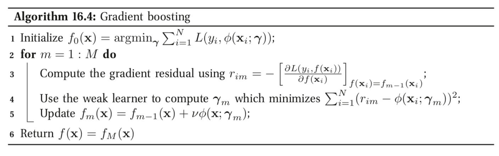
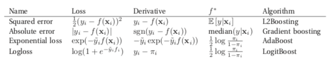
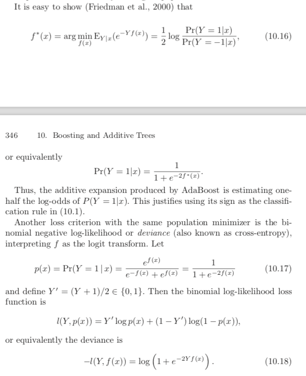
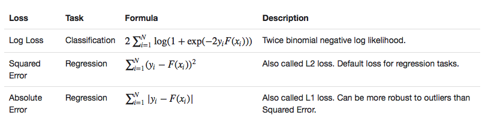
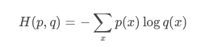
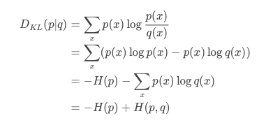
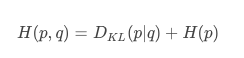
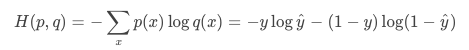

<h1 align="center">梯度提升树 gradient boosting tree</h1>
<h2>一、理论</h2>
理论部分源自 Machine Learning-A Probabilistic Perspective(MLAPP)和Elements of Statistical Machine Learning(ESML)

<h3>1、boosting</h3>

boosting是一种greedy算法，书中也称作一种adaptive basis-function model (ABM)，形式如下：

φm称作弱学习器，可以是任意算法模型，常用的是CART。boosting由多个弱学习器组成，每个弱学习器的目的都是关注上一轮分类错误的样本，从而进一步减少模型的loss。其中权重w的目的是增加错分点的权重，使得越错误的点越容易被关注。最后所有弱学习器的加权或者投票结果就形成了boosting的模型输出。

<h3>2、gradient boosting</h3>
&nbsp&nbsp&nbsp&nbsp gradient boosting的伪代码如下（摘自MLAPP）：

梯度提升（gradient boosting）是一种改进的boosting方法。boosting算法的目标是让模型输出逼近真实值，即最小化Loss=L(y,f)。那么boosting每一步的目标就是：<strong>通过 弱学习器φm 来改进f，使得loss逐步减少</strong>。 
&nbsp&nbsp&nbsp&nbsp 那么问题就来了：f 应该向什么方向改进呢？即φm取什么值才能让loss下降最快呢？这就离梯度gradient很近了，因为loss下降最快的方向就是对f的一阶导数 即梯度gradient。因此<strong>根据gradient梯度来更新f就是gradient boosting的目的。</strong> 
&nbsp&nbsp&nbsp&nbsp那么具体怎么更新呢：<strong>每次根据gradient(伪代码中 r )拟合一个弱学习器φ，并累加给f（乘以学习速率）。即gradient boosting模型中每个弱学习器都是对gradient的拟合。</strong>

<h4>（1）损失函数定义loss </h4>

根据任务类型不同，损失函数Loss的定义也不同，具体见下图（MLAPP 556页 table16.1）：

回归问题主要用squared error，分类问题主要用logloss

<h4>（2）Logloss推导</h4>

平方损失和绝对值损失不详细介绍，Expoential指数损失过于关注错误样本，因此受到错误样本的干扰很大（比如非常离谱的数据），这里也不做介绍。 
此处主要讨论gradient boosting的Logloss如何得来的，不啰嗦，直接赋上ESML的介绍：

公式中Y=1的概率P=1.0 / (1.0 + math.exp(-2.0 * margin))，margin即为公式中的f(x)。训练完成后，即可根据该公式计算概率。 
其中，根据p(x)推导出损失函数 l(Y,p(x))不难，根据p(x)也可以推导出f(x)=1/2的log-odds 
<strong>但问题是：p(x)如何而来？为什么不是LR一样的sigmoid函数？</strong>

<h4>注意：这里的Loss是 y与f之间的loss，其中导数也是对f求导（因为每个f是一个弱分类器，目的是f拟合梯度gradient），这里的loss和gradient都与x无关</h4>

<h4>（3）spark中损失函数</h4>
&nbsp&nbsp&nbsp&nbsp在spark采用的损失函数为：

其中Logloss是在（2）中logloss 2倍，因此导数为：gradient = -4 y / (1 + exp(2 y F(x)))

<h3>3、扩展cross-entropy，KL，logistic</h3>
假设两个概率分布p(x)和q(x)，其中p是已知分布（比如y），而q是未知分布（比如预测值hat{y}）

首先cross entropy的定义是：

KL divergence的定义和推导为：

因此，cross entropy交叉熵可以表示为：

其中 p是已知的 因此H(p)是常数，也就是说cross entropy交叉熵和kl之间只差一个常数。 
在二分类中，p∈{y,1-y}，而q∈{y^,1−y^}，这样，cross entropy就可以写成logistic loss

<h2>二、源码</h2>
org.apache.spark.mllib.tree.GradientBoostedTrees
<h3>1、train</h3>

训练每一个弱学习器DecisionTree的时候，都会用到决策树的训练方法（随机森林RandomForest的特例），具体讲解见<a href="https://github.com/Demmon-tju/spark-ml-source-mark/blob/master/ml/tree/decision_tree.md">决策树 decision tree</a>。接下来，涉及到决策树的训练不在赘述。

主要的代码位于GradientBoostedTrees.boost方法中
<pre><code>

/**
   * Internal method for performing regression using trees as base learners.
   * @param input training dataset
   * @param validationInput validation dataset, ignored if validate is set to false.
   * @param boostingStrategy boosting parameters
   * @param validate whether or not to use the validation dataset.
   * @param seed Random seed.
   * @return tuple of ensemble models and weights:
   *         (array of decision tree models, array of model weights)
   */
  def boost(
      input: RDD[LabeledPoint],
      validationInput: RDD[LabeledPoint],
      boostingStrategy: OldBoostingStrategy,
      validate: Boolean,
      seed: Long,
      featureSubsetStrategy: String): (Array[DecisionTreeRegressionModel], Array[Double]) = {
    val timer = new TimeTracker()
    timer.start("total")
    timer.start("init")
    
    boostingStrategy.assertValid()

    // Initialize gradient boosting parameters
    val numIterations = boostingStrategy.numIterations
    val baseLearners = new Array[DecisionTreeRegressionModel](numIterations)
    val baseLearnerWeights = new Array[Double](numIterations)
    val loss = boostingStrategy.loss
    val learningRate = boostingStrategy.learningRate

    // Prepare strategy for individual trees, which use regression with variance impurity.
    val treeStrategy = boostingStrategy.treeStrategy.copy
    val validationTol = boostingStrategy.validationTol
    treeStrategy.algo = OldAlgo.Regression
    treeStrategy.impurity = OldVariance
    treeStrategy.assertValid()

    // Cache input
    val persistedInput = if (input.getStorageLevel == StorageLevel.NONE) {
      input.persist(StorageLevel.MEMORY_AND_DISK)
      true
    } else {
      false
    }

    // Prepare periodic checkpointers
    val predErrorCheckpointer = new PeriodicRDDCheckpointer[(Double, Double)](
      treeStrategy.getCheckpointInterval, input.sparkContext)
    val validatePredErrorCheckpointer = new PeriodicRDDCheckpointer[(Double, Double)](
      treeStrategy.getCheckpointInterval, input.sparkContext)

    timer.stop("init")

    logDebug("##########")
    logDebug("Building tree 0")
    logDebug("##########")

    // Initialize tree
    //***第一棵树的拟合目标就是label，而非梯度***
    timer.start("building tree 0")
    val firstTree = new DecisionTreeRegressor().setSeed(seed)
    val firstTreeModel = firstTree.train(input, treeStrategy, featureSubsetStrategy)
    //***第一个树的权重设置为1***
    val firstTreeWeight = 1.0
    baseLearners(0) = firstTreeModel
    baseLearnerWeights(0) = firstTreeWeight

    var predError: RDD[(Double, Double)] =
      computeInitialPredictionAndError(input, firstTreeWeight, firstTreeModel, loss)
    predErrorCheckpointer.update(predError)
    logDebug("error of gbt = " + predError.values.mean())

    // Note: A model of type regression is used since we require raw prediction
    timer.stop("building tree 0")

    var validatePredError: RDD[(Double, Double)] =
      computeInitialPredictionAndError(validationInput, firstTreeWeight, firstTreeModel, loss)
    if (validate) validatePredErrorCheckpointer.update(validatePredError)
    var bestValidateError = if (validate) validatePredError.values.mean() else 0.0
    var bestM = 1

    var m = 1
    var doneLearning = false
    //***逐步构建m个树，每个树都是对当前梯度的拟合***
    while (m < numIterations && !doneLearning) {
      // Update data with pseudo-residuals
      //***修改数据类型，利用负梯度（-gradient）替换label，从而利用负梯度来构建决策树***
      val data = predError.zip(input).map { case ((pred, _), point) =>
        LabeledPoint(-loss.gradient(pred, point.label), point.features)
      }

      timer.start(s"building tree $m")
      logDebug("###################################################")
      logDebug("Gradient boosting tree iteration " + m)
      logDebug("###################################################")

      //***根据替换后的数据，训练决策树，即根据负梯度训练决策树***
      //***这里其实利用随机森林RandomForest类进行训练(一棵树的森林)***
      val dt = new DecisionTreeRegressor().setSeed(seed + m)
      val model = dt.train(data, treeStrategy, featureSubsetStrategy)
      timer.stop(s"building tree $m")
      // Update partial model
      baseLearners(m) = model
      // Note: The setting of baseLearnerWeights is incorrect for losses other than SquaredError.
      //       Technically, the weight should be optimized for the particular loss.
      //       However, the behavior should be reasonable, though not optimal.
      //***这里将学习速率learning rate当作了权重weight***
      baseLearnerWeights(m) = learningRate

      predError = updatePredictionError(
        input, predError, baseLearnerWeights(m), baseLearners(m), loss)
      predErrorCheckpointer.update(predError)
      logDebug("error of gbt = " + predError.values.mean())

      if (validate) {
        // Stop training early if
        // 1. Reduction in error is less than the validationTol or
        // 2. If the error increases, that is if the model is overfit.
        // We want the model returned corresponding to the best validation error.

        validatePredError = updatePredictionError(
          validationInput, validatePredError, baseLearnerWeights(m), baseLearners(m), loss)
        validatePredErrorCheckpointer.update(validatePredError)
        val currentValidateError = validatePredError.values.mean()
        if (bestValidateError - currentValidateError < validationTol * Math.max(
          currentValidateError, 0.01)) {
          doneLearning = true
        } else if (currentValidateError < bestValidateError) {
          bestValidateError = currentValidateError
          bestM = m + 1
        }
      }
      m += 1
    }

    timer.stop("total")

    logInfo("Internal timing for DecisionTree:")
    logInfo(s"$timer")

    predErrorCheckpointer.unpersistDataSet()
    predErrorCheckpointer.deleteAllCheckpoints()
    validatePredErrorCheckpointer.unpersistDataSet()
    validatePredErrorCheckpointer.deleteAllCheckpoints()
    if (persistedInput) input.unpersist()

    if (validate) {
      (baseLearners.slice(0, bestM), baseLearnerWeights.slice(0, bestM))
    } else {
      (baseLearners, baseLearnerWeights)
    }
    }
</code>
</pre>
<ol>
代码比较容易理解，这里只强调几点：
<li>回归树：<strong>梯度提升树的弱学习器永远是回归树</strong>，利用回归树拟合梯度（连续值）</li>
<li>第一棵树：第一棵树的学习目标是label，因为此时没有梯度</li>
<li>拟合梯度：从第二棵树开始，每个决策树学习的目标都是梯度，因此代码中每次循环都要修改data的标签列为当前梯度</li>
<li>权重：第一棵树的权重是1，之后每棵树的权重=学习速率。其实权重weight也应该根据loss优化产生，但是此处利用学习速率也存在合理性，因为每次 f 的更新都是弱学习器*学习速率，因此最终的 f 构成，利用学习速率=权重，也可以理解</li>
</ol>

<h3>2、predict</h3>
<h4>（1）predict策略：</h4>
 spark中的组合树模型如随机森林模型RandomForestModel和梯度提升模型GradientBoostedTreesModel，都是继承TreeEnsembleModel，在该模型中定义了预测predice的各种策略的实现。 
<ol>
主要定义了两种预测predict策略：
<li>加权求和sum：每棵树的输出*权重之后，求和</li>
<li>投票vote：统计每个prediction的权重weight和，权重和最大的prediction就是结果</li>
</ol>
<pre><code>

/**
   * Predicts for a single data point using the weighted sum of ensemble predictions.
   *
   * @param features array representing a single data point
   * @return predicted category from the trained model
   */
  private def predictBySumming(features: Vector): Double = {
    val treePredictions = trees.map(_.predict(features))
    blas.ddot(numTrees, treePredictions, 1, treeWeights, 1)
  }

  /**
   * Classifies a single data point based on (weighted) majority votes.
   */
  private def predictByVoting(features: Vector): Double = {
    val votes = mutable.Map.empty[Int, Double]
    trees.view.zip(treeWeights).foreach { case (tree, weight) =>
      val prediction = tree.predict(features).toInt
      votes(prediction) = votes.getOrElse(prediction, 0.0) + weight
    }
    votes.maxBy(_._2)._1
  }

</code></pre>
<ol>
针对不同的问题和策略，预测的代码如下：
<li>回归问题：求和sum或者取平均值</li>
<li>分类问题：求和sum或者投票vote</li>
</ol>
<pre><code>
/**
   * Predict values for a single data point using the model trained.
   *
   * @param features array representing a single data point
   * @return predicted category from the trained model
   */
  def predict(features: Vector): Double = {
    (algo, combiningStrategy) match {
      //回归+求和sum
      case (Regression, Sum) =>
        predictBySumming(features)
      //回归+平均
      case (Regression, Average) =>
        predictBySumming(features) / sumWeights
      //分类+sum
      case (Classification, Sum) => // binary classification
        val prediction = predictBySumming(features)
        // TODO: predicted labels are +1 or -1 for GBT. Need a better way to store this info.
        //标签转换为{0,1}
        if (prediction > 0.0) 1.0 else 0.0
      //分类+vote
      case (Classification, Vote) =>
        predictByVoting(features)
      case _ =>
        throw new IllegalArgumentException(
          "TreeEnsembleModel given unsupported (algo, combiningStrategy) combination: " +
            s"($algo, $combiningStrategy).")
    }
</code></pre>

<h4>（2）概率Probability：</h4>
spark的predict中返回的是label的预测值，而非预测概率，预测值不够灵活如无法排序等。 
根据理论部分的公式，预测为正类的概率P=1.0 / (1.0 + math.exp(-2.0 * margin))，此处的margin即为每棵树输出值的加权和。因此，梯度提升树gbt的预测概率代码如下：
<pre><code>
def score(features: Vector,gbdt: GradientBoostedTreesModel): Double = {
    val treePredictions = gbdt.trees.map(_.predict(features))
    blas.ddot(gbdt.numTrees, treePredictions, 1, gbdt.treeWeights, 1)
}
val labelAndPreds = testData.map { point =>
        var margin = score(point.features,model)
        prediction = 1.0 / (1.0 + math.exp(-2.0 * margin))
        (point.label, Vectors.dense(1.0-prediction, prediction))
}

</code></pre>