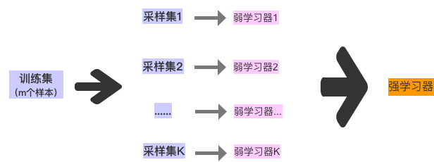

<h1 align="center">随机森林 random forest</h1>
<h2>简介</h2>
<h3>1. bagging</h3>

如下图所示，bagging的思想“三个臭皮匠胜过诸葛亮” ，即训练多个弱分类器，之后大家共同产生最终结果：投票表决或者平均值。

其中每个若分类器之间没有前后关联（与boosting区别），训练若分类器的前提就是随机采样。这里的抽样是有放回随机抽样，一般每个采样集和训练集的数量一致，即每个采样集也要采样m个样本。对于K个若分类器，就要进行K次随机采样，由此得到K个不同的样本子集。

对于一个样本，它在某一次含m个样本的训练集的随机采样中，每次被采集到的概率是1/m。不被采集到的概率为1−1/m。如果m次采样都没有被采集中的概率是(1-1/m)的m次方。当m无穷大这个公式约等于1/e≃0.368。
因此，在bagging的每轮随机采样中，训练集中大约有36.8%的数据没有被采样集采集中。这部分数据被称之为袋外数据(Out Of Bag, 简称OOB)。这些数据没有参与训练集模型的拟合，因此可以用来检测模型的泛化能力

<ol>
抽样角度，与GBDT简单对比
<li>bagging是有放回抽样，而GBDT是无放回抽样</li>
<li>bagging每个都是弱分类器都是训练样本的采样，因此泛化能力强。因此每个若分类器不要特别强（树的depth不用太深）</li>
</ol>

<h3>2. random forest 随机森林</h3>

理论上，bagging的若分类器可以是任意模型，但是较为通用的若分类器主要有两种：一个是决策树，另一个就是神经网络。当若分类器为决策树是，bagging就变成了随机森林。以下就spark2.3的random forest的代码进行详细介绍。 
需要强调的是：spark的实现中，不仅进行了样本采样，同时也进行了特征抽样（列采样）

<h5>Tips：关于决策树的知识请参考上一篇文章《决策树 decision tree》</h5>

<h2>一、整体思路</h2>

<h3>1、Stack存储Nodes</h3>
（1）Forest中的所有tree一起处理； 
（2）利用Stack存储Nodes：如果当前正在split某个tree的节点，那么新的Nodes也属于该tree，因此下一轮迭代训练的是同一棵tree。虽然同时训练多个tree，但并不是并行训练多个tree，而是focus on completing trees。 
（3）每次在Stack中取出若干个Nodes，组成nodesForGroup，一并处理：RandomForest.findBestSplits，一起寻找最优

<code><pre>
代码位于RandomForest.scala的run方法中
/*
      Stack of nodes to train: (treeIndex, node)
      The reason this is a stack is that we train many trees at once, but we want to focus on
      completing trees, rather than training all simultaneously.  If we are splitting nodes from
      1 tree, then the new nodes to split will be put at the top of this stack, so we will continue
      training the same tree in the next iteration.  This focus allows us to send fewer trees to
      workers on each iteration; see topNodesForGroup below.
     */
    val nodeStack = new mutable.ArrayStack[(Int, LearningNode)]

    val rng = new Random()
    rng.setSeed(seed)

    // Allocate and queue root nodes.
    val topNodes = Array.fill[LearningNode](numTrees)(LearningNode.emptyNode(nodeIndex = 1))
    Range(0, numTrees).foreach(treeIndex => nodeStack.push((treeIndex, topNodes(treeIndex))))

    timer.stop("init")

    while (nodeStack.nonEmpty) {
      // Collect some nodes to split, and choose features for each node (if subsampling).
      // Each group of nodes may come from one or multiple trees, and at multiple levels.
      val (nodesForGroup, treeToNodeToIndexInfo) =
        RandomForest.selectNodesToSplit(nodeStack, maxMemoryUsage, metadata, rng)
      // Sanity check (should never occur):
      assert(nodesForGroup.nonEmpty,
        s"RandomForest selected empty nodesForGroup.  Error for unknown reason.")

      //找到nodes对应的树的根节点，只需要相应的trees
      // Only send trees to worker if they contain nodes being split this iteration.
      val topNodesForGroup: Map[Int, LearningNode] =
        nodesForGroup.keys.map(treeIdx => treeIdx -> topNodes(treeIdx)).toMap

      // Choose node splits, and enqueue new nodes as needed.
      timer.start("findBestSplits")
      RandomForest.findBestSplits(baggedInput, metadata, topNodesForGroup, nodesForGroup,
        treeToNodeToIndexInfo, splits, nodeStack, timer, nodeIdCache)
      timer.stop("findBestSplits")
    }
</pre></code>
<h3>2、若干Nodes寻找最优</h3>
<ol>
<li>
首先，每个分区内部循环所有数据，计算相应统计量；
</li>
<li>
每个分区计算完成后，通过reduceByKey，将同一个node的数据merge到一起；
</li>
<li>
最后，对每个node的统计量，寻找最后split；
</li>
</ol>
下面粘贴整体思路的代码（RandomForest.scala的findBestSplits方法中）
<code><pre>
// In each partition, iterate all instances and compute aggregate stats for each node,
    // yield a (nodeIndex, nodeAggregateStats) pair for each node.
    // After a `reduceByKey` operation,
    // stats of a node will be shuffled to a particular partition and be combined together,
    // then best splits for nodes are found there.
    // Finally, only best Splits for nodes are collected to driver to construct decision tree.
    val nodeToFeatures = getNodeToFeatures(treeToNodeToIndexInfo)
    val nodeToFeaturesBc = input.sparkContext.broadcast(nodeToFeatures)

    //利用mapPartition计算每个partition的统计量
    val partitionAggregates: RDD[(Int, DTStatsAggregator)] = if (nodeIdCache.nonEmpty) {
      input.zip(nodeIdCache.get.nodeIdsForInstances).mapPartitions { points =>
        // Construct a nodeStatsAggregators array to hold node aggregate stats,
        // each node will have a nodeStatsAggregator
        val nodeStatsAggregators = Array.tabulate(numNodes) { nodeIndex =>
          val featuresForNode = nodeToFeaturesBc.value.map { nodeToFeatures =>
            nodeToFeatures(nodeIndex)
          }
          new DTStatsAggregator(metadata, featuresForNode)
        }

        // iterator all instances in current partition and update aggregate stats
        points.foreach(binSeqOpWithNodeIdCache(nodeStatsAggregators, _))

        // transform nodeStatsAggregators array to (nodeIndex, nodeAggregateStats) pairs,
        // which can be combined with other partition using `reduceByKey`
        nodeStatsAggregators.view.zipWithIndex.map(_.swap).iterator
      }
    } else {
      input.mapPartitions { points =>
        // Construct a nodeStatsAggregators array to hold node aggregate stats,
        // each node will have a nodeStatsAggregator
        val nodeStatsAggregators = Array.tabulate(numNodes) { nodeIndex =>
          val featuresForNode = nodeToFeaturesBc.value.flatMap { nodeToFeatures =>
            Some(nodeToFeatures(nodeIndex))
          }
          new DTStatsAggregator(metadata, featuresForNode)
        }

        // iterator all instances in current partition and update aggregate stats
        points.foreach(binSeqOp(nodeStatsAggregators, _))

        // transform nodeStatsAggregators array to (nodeIndex, nodeAggregateStats) pairs,
        // which can be combined with other partition using `reduceByKey`
        nodeStatsAggregators.view.zipWithIndex.map(_.swap).iterator
      }
    }
    //reduceByKey对每个node的统计量进行merge
    val nodeToBestSplits = partitionAggregates.reduceByKey((a, b) => a.merge(b)).map {
      case (nodeIndex, aggStats) =>
        val featuresForNode = nodeToFeaturesBc.value.flatMap { nodeToFeatures =>
          Some(nodeToFeatures(nodeIndex))
        }

        //每个node，根据其统计量，寻找最优split
        // find best split for each node
        val (split: Split, stats: ImpurityStats) =
          binsToBestSplit(aggStats, splits, featuresForNode, nodes(nodeIndex))
        (nodeIndex, (split, stats))
    }.collectAsMap()

</pre></code>

<h2>二、树的构造：特征分桶bins</h2>

bins的主要代码位于RandomForest.findSplits中，其中只实现了findSplitsBySorting。分为三种情况分别处理：连续特征、无序离散特征、有序离散特征，如下：
<h3>连续特征bins</h3>
根据特征值排序，之后等频分割
 
<pre><code>

/**
   * Find splits for a continuous feature
   * NOTE: Returned number of splits is set based on `featureSamples` and
   *       could be different from the specified `numSplits`.
   *       The `numSplits` attribute in the `DecisionTreeMetadata` class will be set accordingly.
   *
   * @param featureSamples feature values of each sample
   * @param metadata decision tree metadata
   *                 NOTE: `metadata.numbins` will be changed accordingly
   *                       if there are not enough splits to be found
   * @param featureIndex feature index to find splits
   * @return array of split thresholds
   */
  private[tree] def findSplitsForContinuousFeature(
      featureSamples: Iterable[Double],
      metadata: DecisionTreeMetadata,
      featureIndex: Int): Array[Double] = {
    require(metadata.isContinuous(featureIndex),
      "findSplitsForContinuousFeature can only be used to find splits for a continuous feature.")

    val splits: Array[Double] = if (featureSamples.isEmpty) {
      Array.empty[Double]
    } else {
      val numSplits = metadata.numSplits(featureIndex)

      // get count for each distinct value
      //统计每个特征值的次数，并按照特征值排序
      val (valueCountMap, numSamples) = featureSamples.foldLeft((Map.empty[Double, Int], 0)) {
        case ((m, cnt), x) =>
          (m + ((x, m.getOrElse(x, 0) + 1)), cnt + 1)
      }
      // sort distinct values
      val valueCounts = valueCountMap.toSeq.sortBy(_._1).toArray

      val possibleSplits = valueCounts.length - 1
      if (possibleSplits == 0) {
        // constant feature
        Array.empty[Double]
      } else if (possibleSplits <= numSplits) {
        // if possible splits is not enough or just enough, just return all possible splits
        (1 to possibleSplits)
          .map(index => (valueCounts(index - 1)._1 + valueCounts(index)._1) / 2.0)
          .toArray
      } else {
        //等频分割
        // stride between splits
        val stride: Double = numSamples.toDouble / (numSplits + 1)
        logDebug("stride = " + stride)
  
        //遍历每个（特征值->次数）
        // iterate `valueCount` to find splits
        val splitsBuilder = mutable.ArrayBuilder.make[Double]
        var index = 1
        // currentCount: sum of counts of values that have been visited
        var currentCount = valueCounts(0)._2
        // targetCount: target value for `currentCount`.
        // If `currentCount` is closest value to `targetCount`,
        // then current value is a split threshold.
        // After finding a split threshold, `targetCount` is added by stride.
        var targetCount = stride
        while (index < valueCounts.length) {
          val previousCount = currentCount
          currentCount += valueCounts(index)._2
          val previousGap = math.abs(previousCount - targetCount)
          val currentGap = math.abs(currentCount - targetCount)
          // If adding count of current value to currentCount
          // makes the gap between currentCount and targetCount smaller,
          // previous value is a split threshold.
          //只要满足这个条件，previous一定是最接近的等频分割点
          if (previousGap < currentGap) {
            splitsBuilder += (valueCounts(index - 1)._1 + valueCounts(index)._1) / 2.0
            targetCount += stride
          }
          index += 1
        }

        splitsBuilder.result()
      }
    }
    splits
  }
</code></pre> 

target每次增加strike步长，是完美的等频分割点，但是由于特征值的频次千变万化，不可能完美分割，因此只能找最接近分割点的特征值。while循环里面pre和cur都在不断的从target左侧向其移动，甚至超过target。当与target距离最近的时候，就是最接近的等频分割点。因为pre总在cur的左面，因此会有三种情况：（1）pre和cur都在target左面，此时不可能previousGap < currentGap；（2）pre在target左面，cur在右面，如果previousGap > currentGap,那么不能确定是否达到了等频，只能继续向target移动，直至previousGap < currentGap；（3）上述（2）的情况下，有可能移动导致pre和cur都在target右侧，那么一定就满足previousGap < currentGap，pre就是最优分割点

结论：多个等频的bins
<h3>离散且无序特征bin：</h3>

当n大于2时，n个数的全组合一共有(2^n)-1种。
当对n个元素进行全组合的时候，可以用一个n位的二进制数表示取法。
1表示在该位取，0表示不取。

例如，对ABC三个元素进行全组合，用二进制表示如下   
001表示取C，      001=1  
010表示取B，      010=2  
011表示取BC，    011=3  
100表示取A，      100=4  
101表示取AC       101=5  
110表示取AB，    110=6  
111表示取ABC      111=7  
很显然ABC三个元素全组合共有2^3-1=7种。
推广到对n个元素进行全排列，取法就是从1到2^n-1的所有二进制形式 
 
<code><pre>
findSplitsBySorting 中处理无序离散特征
case i if metadata.isCategorical(i) && metadata.isUnordered(i) =>
        // Unordered features
        // 2^(maxFeatureValue - 1) - 1 combinations
        val featureArity = metadata.featureArity(i)
        Array.tabulate[Split](metadata.numSplits(i)) { splitIndex =>
          //循环所有splitIndex（即例子中的1-7）
          val categories = extractMultiClassCategories(splitIndex + 1, featureArity)
          //CategoricalSplit类中包含leftCatgories数组，表示左侧子节点应该包含的特征值
          //(即1的positions)，具体查看《tree_base》
          new CategoricalSplit(i, categories.toArray, featureArity)
        }
        
        
/** 该方法为：计算input的二进制中1的positions
   * Nested method to extract list of eligible categories given an index. It extracts the
   * position of ones in a binary representation of the input. If binary
   * representation of an number is 01101 (13), the output list should (3.0, 2.0,
   * 0.0). The maxFeatureValue depict the number of rightmost digits that will be tested for ones.
   */
  private[tree] def extractMultiClassCategories(
      input: Int,
      maxFeatureValue: Int): List[Double] = {
    var categories = List[Double]()
    var j = 0
    var bitShiftedInput = input
    while (j < maxFeatureValue) {
      if (bitShiftedInput % 2 != 0) {
        // updating the list of categories.
        categories = j.toDouble :: categories
      }
      // Right shift by one
      bitShiftedInput = bitShiftedInput >> 1
      j += 1
    }
    categories
  }
</code></pre> 

<h3>离散有序特征bin：</h3>

每个特征值都是一个bin 。

<h3>bin小结：</h3>
将三类特征分别进行转化成多个bins，每个bin代表某种特征集合，也有相应的统计量
<ol>
spark中针对于每个(node, feature, bin)：对应一个states，表示统计量
<li>二分类states：长度为2，代表label=0和label=1的样本总数；</li>
<li>多分类states：长度为label的数量，分别代表其样本总数；</li>
<li>回归states ： 长度为3，分别代表样本（instanceWeight）总和，instanceWeight * label总和，instanceWeight * label * label总和</li>
</ol>
Tips：根据bin进行split分裂成左右节点,那么左右节点都包含对应的一系列bins，根据bin的统计量计算最优split

<h2>三、树的构造：特征split</h2>

每个特征进行bin之后，形成了若干个(feature, bin)，根据该bin构造split，并计算其impurity，寻找其中最优split。Split类详解见《tree base》 
<ol>
如何根据bin构造split呢，分三种情况：
<li>连续特征：根据特征值排序后，从左至右逐个bin构造split，即左节点为<=当前bin阈值的特征值，右节点为>bin；</li>
<li>有序离散特征：与上面类似，有序特征也会根据一定规则排序（下面会介绍），之后从左至右逐个bin构造split（并判断左右节点）；</li>
<li>无序离散特征：对于每个bin都是一个split(CategoricalSplit)，左节点为该bin代表的特征值，右节点=父节点-左节点 </li>
</ol>
具体介绍如下
<h3>连续特征Splits</h3>
特征bin之后形成了由threshold构成的数组（bin节介绍过），针对每个threshold构造一个ContinuousSplit，位于findSplitsBySorting方法中
<code><pre>
private def findSplitsBySorting(
      input: RDD[LabeledPoint],
      metadata: DecisionTreeMetadata,
      continuousFeatures: IndexedSeq[Int]): Array[Array[Split]] = {

    val continuousSplits: scala.collection.Map[Int, Array[Split]] = {
      // reduce the parallelism for split computations when there are less
      // continuous features than input partitions. this prevents tasks from
      // being spun up that will definitely do no work.
      val numPartitions = math.min(continuousFeatures.length, input.partitions.length)

      input
        .flatMap { point =>
          continuousFeatures.map(idx => (idx, point.features(idx))).filter(_._2 != 0.0)
        }.groupByKey(numPartitions)
        .map { case (idx, samples) =>
          val thresholds = findSplitsForContinuousFeature(samples, metadata, idx)
          val splits: Array[Split] = thresholds.map(thresh => new ContinuousSplit(idx, thresh))
          logDebug(s"featureIndex = $idx, numSplits = ${splits.length}")
          (idx, splits)
        }.collectAsMap()
    }
    ...
    ...
}
</pre></code>
每个特征是一个Array[Split]，若干特征即Map[featureIndex,Array[Split]]
<h3>有序离散特征Splits</h3>
findSplitsBySorting中对该情况没有预先形成Split而是返回Array.empty[Split]，真正的Split是在寻找最优分割binsToBestSplit中进行划分的。 
在这里，可以提前了解下如何划分：划分方法和连续特征有些类似，主要区别在于连续特征中直接根据特征值排序，但是离散特征则不同。
而是根据centorid对特征值排序，逐步分割，有n个值则有n-1个分割：例如排序后特征值为A，B，C，那么可以得到两个分割：A|BC、 AB|C 。 
<ol>
centorid如何计算(具体原理See Section 9.2.4 in Elements of Statistical Machine Learning for details.) 
<li>多分类：根据impurity排序，即centroid=impurity（Entropy或Gini）
</li>
<li>二分类：根据该特征值label=1的样本数量进行排序
</li>
<li>回归：根据该特征值的预测结果进行排序，预测值为states(1)/count即平均值
</li>
</ol>

具体代码如下（binsToBestSplit方法中），centroid分三种情况
 
<code><pre>
 // Ordered categorical feature
          val nodeFeatureOffset = binAggregates.getFeatureOffset(featureIndexIdx)
          val numCategories = binAggregates.metadata.numBins(featureIndex)

          /* Each bin is one category (feature value).
           * The bins are ordered based on centroidForCategories, and this ordering determines which
           * splits are considered.  (With K categories, we consider K - 1 possible splits.)
           *
           * centroidForCategories is a list: (category, centroid)
           */
          val centroidForCategories = Range(0, numCategories).map { case featureValue =>
            val categoryStats =
              binAggregates.getImpurityCalculator(nodeFeatureOffset, featureValue)
            val centroid = if (categoryStats.count != 0) {
              if (binAggregates.metadata.isMulticlass) {
                // multiclass classification
                // For categorical variables in multiclass classification,
                // the bins are ordered by the impurity of their corresponding labels.
                categoryStats.calculate()
              } else if (binAggregates.metadata.isClassification) {
                // binary classification
                // For categorical variables in binary classification,
                // the bins are ordered by the count of class 1.
                categoryStats.stats(1)
              } else {
                // regression
                // For categorical variables in regression and binary classification,
                // the bins are ordered by the prediction.
                categoryStats.predict
              }
            } else {
              Double.MaxValue
            }
            (featureValue, centroid)
          }

          logDebug("Centroids for categorical variable: " + centroidForCategories.mkString(","))

          // bins sorted by centroids
          val categoriesSortedByCentroid = centroidForCategories.toList.sortBy(_._2)

</code></pre> 
之后遍历每个分割，寻找最优split，后面会统一介绍。

</ol>
<h3>无序离散特征Splits</h3>
findSplitsBySorting中每个bin都是一个Split，CategorySplit的变量leftCatgories包含bin中的特征（二进制1的positions）。 
<code><pre>
case i if metadata.isCategorical(i) && metadata.isUnordered(i) =>
        // Unordered features
        // 2^(maxFeatureValue - 1) - 1 combinations
        val featureArity = metadata.featureArity(i)
        Array.tabulate[Split](metadata.numSplits(i)) { splitIndex =>
          //categories即为bin中包含的特征值（二进制1的positions）
          val categories = extractMultiClassCategories(splitIndex + 1, featureArity)
          new CategoricalSplit(i, categories.toArray, featureArity)
        }
</pre></code>
<h3>Split总结</h3>
1、连续特征：比较容易处理，不论而分类，多分类还是回归任务的处理方式不变；。 
2、对于离散特征，分为有序和无序两种处理方式。但是有序还是无序与特征值无关，而是一种简化方法：由于无序离散特征(2^N)-1中分裂方法，如果N特别大，计算和存储要求比较大，因此利用有序离散特征的处理方式进行处理。
<ol type="I">
看作有序离散特征还是无序离散特征与任务有关：
<li>二分类、回归：针对这两类任务，将离散特征看作有序离散特征进行处理，虽然是一种近似的方法，但是也可以找到最优分裂，具体原理见Section 9.2.4 in Elements of Statistical Machine Learning，</li>
<li>多分类：对于多分裂并没有从理论上证明可以看作有序离散特征处理，但是也有一些近似方案被学者提出，在spark中的近似方案就是根据impurity排序看作有序特征。</li>
</ol>

<h2>四、树的构造：寻找最优split</h2>

对每个特征分成若干个splits之后，如何找到最优的split呢？根据split将节点分裂成左右子节点后，通过相应的统计量计算impurity，进而得到最优split。此处也要针对不同的特征分别处理：有序特征（连续特征和有序离散特征）、无序离散特征 
<ol>
预备知识
<li>每个节点Node都对应一个ImpurityAggregator（GiniAggregator/EntropyAggregator/VarianceAggregator），而每个Aggregator都包含一个allStates:Array[Double]，表示该节点对应的所有特征的所有bins(平铺)的统计量。统计量的涵义在Bins章节有过介绍，不再赘述。</li>
<li>每个(Node,feature,bin)都维持自身的一个统计量states，同时也要维持一个父节点的parentStats，用于无序离散节点的bestSplit</li>
    更新特征统计量方法如下：
<code>
<pre>
/*
     * Performs a sequential aggregation over a partition for a particular tree and node.
     *
     * For each feature, the aggregate sufficient statistics are updated for the relevant
     * bins.
     *
     * @param treeIndex Index of the tree that we want to perform aggregation for.
     * @param nodeInfo The node info for the tree node.
     * @param agg Array storing aggregate calculation, with a set of sufficient statistics
     *            for each (node, feature, bin).
     * @param baggedPoint Data point being aggregated.
     */
    def nodeBinSeqOp(
        treeIndex: Int,
        nodeInfo: NodeIndexInfo,
        agg: Array[DTStatsAggregator],
        baggedPoint: BaggedPoint[TreePoint]): Unit = {
      if (nodeInfo != null) {
        val aggNodeIndex = nodeInfo.nodeIndexInGroup
        val featuresForNode = nodeInfo.featureSubset
        val instanceWeight = baggedPoint.subsampleWeights(treeIndex)
        if (metadata.unorderedFeatures.isEmpty) {
          orderedBinSeqOp(agg(aggNodeIndex), baggedPoint.datum, instanceWeight, featuresForNode)
        } else {
          mixedBinSeqOp(agg(aggNodeIndex), baggedPoint.datum, splits,
            metadata.unorderedFeatures, instanceWeight, featuresForNode)
        }
        agg(aggNodeIndex).updateParent(baggedPoint.datum.label, instanceWeight)
      }
    }
</pre>
</code>
其中涉及到orderedBinSeqOp和mixedBinSeqOp等方法，不详细介绍。 
tips: 
(1)、每次最后都要更新parents，因此parents相当于所有数据的统计量 
(2)、有序特征：每次只会有一个bin被更新 
(3)、无序特征：每次会有若干个相关的bins被更新 
</ol>

<h3>1、有序特征最优split</h3>
注：有序离散特征需要根据不同情况进行排序，这部分在Splits章节介绍过，因此此处略过。
<ol>
步骤
<li>自左向右，对bins的统计量进行累加
<code>
<pre>
binsToBestSplit方法中
          // Cumulative sum (scanLeft) of bin statistics.
          // Afterwards, binAggregates for a bin is the sum of aggregates for
          // that bin + all preceding bins.
          val nodeFeatureOffset = binAggregates.getFeatureOffset(featureIndexIdx)
          var splitIndex = 0
          while (splitIndex < numSplits) {
            binAggregates.mergeForFeature(nodeFeatureOffset, splitIndex + 1, splitIndex)
            splitIndex += 1
          }
</pre>
</code>
累加之后，最后一个bin的统计量=sum(全部统计量)
</li>
<li>
累加之后，逐个bin遍历，每个bin的阈值都是一个潜在的最优split。阈值左侧为左节点，阈值右侧为右节点。由于之前的累加，当前bin的统计量就是左侧所有bins统计量的sum，而右侧统计量=（最后一个bin的统计量—当前bin统计量）
<code>
<pre>
         binsToBestSplit方法中
         // Find best split.
          val (bestFeatureSplitIndex, bestFeatureGainStats) =
            Range(0, numSplits).map { case splitIdx =>
              val leftChildStats = binAggregates.getImpurityCalculator(nodeFeatureOffset, splitIdx)
              //最后一个bin统计量：numSplits
              val rightChildStats =
                binAggregates.getImpurityCalculator(nodeFeatureOffset, numSplits)
              //减去 当前
              rightChildStats.subtract(leftChildStats)
              gainAndImpurityStats = calculateImpurityStats(gainAndImpurityStats,
                leftChildStats, rightChildStats, binAggregates.metadata)
              (splitIdx, gainAndImpurityStats)
            }.maxBy(_._2.gain)
          (splits(featureIndex)(bestFeatureSplitIndex), bestFeatureGainStats)
</pre>
</code>
</li>
</ol>

<h3>2、无序特征最优split</h3>
<ol>
对于无序特征，每个单独bin都是一个split
<li>左节点：当前bin统计量</li>
<li>右节点：父节点统计量—当前bin统计量</li>
<code>
<pre>
         binsToBestSplit方法中
          // Unordered categorical feature
          val leftChildOffset = binAggregates.getFeatureOffset(featureIndexIdx)
          val (bestFeatureSplitIndex, bestFeatureGainStats) =
            Range(0, numSplits).map { splitIndex =>
              val leftChildStats = binAggregates.getImpurityCalculator(leftChildOffset, splitIndex)
              //父节点-当前节点：parents - left
              val rightChildStats = binAggregates.getParentImpurityCalculator()
                .subtract(leftChildStats)
              gainAndImpurityStats = calculateImpurityStats(gainAndImpurityStats,
                leftChildStats, rightChildStats, binAggregates.metadata)
              (splitIndex, gainAndImpurityStats)
            }.maxBy(_._2.gain)
          (splits(featureIndex)(bestFeatureSplitIndex), bestFeatureGainStats)
</pre>
</code>
</ol>
<h3>3、计算Impurity</h3>
针对每个split，根据《决策树 decision tree》计算增益，并排序max即为最优split。具体代码RandomForest. calculateImpurityStats
<code><pre>
/**
   * Calculate the impurity statistics for a given (feature, split) based upon left/right
   * aggregates.
   *
   * @param stats the recycle impurity statistics for this feature's all splits,
   *              only 'impurity' and 'impurityCalculator' are valid between each iteration
   * @param leftImpurityCalculator left node aggregates for this (feature, split)
   * @param rightImpurityCalculator right node aggregate for this (feature, split)
   * @param metadata learning and dataset metadata for DecisionTree
   * @return Impurity statistics for this (feature, split)
   */
  private def calculateImpurityStats(
      stats: ImpurityStats,
      leftImpurityCalculator: ImpurityCalculator,
      rightImpurityCalculator: ImpurityCalculator,
      metadata: DecisionTreeMetadata): ImpurityStats = {

    val parentImpurityCalculator: ImpurityCalculator = if (stats == null) {
      leftImpurityCalculator.copy.add(rightImpurityCalculator)
    } else {
      stats.impurityCalculator
    }

    val impurity: Double = if (stats == null) {
      parentImpurityCalculator.calculate()
    } else {
      stats.impurity
    }

    val leftCount = leftImpurityCalculator.count
    val rightCount = rightImpurityCalculator.count

    val totalCount = leftCount + rightCount

    // If left child or right child doesn't satisfy minimum instances per node,
    // then this split is invalid, return invalid information gain stats.
    if ((leftCount < metadata.minInstancesPerNode) ||
      (rightCount < metadata.minInstancesPerNode)) {
      return ImpurityStats.getInvalidImpurityStats(parentImpurityCalculator)
    }

    val leftImpurity = leftImpurityCalculator.calculate() // Note: This equals 0 if count = 0
    val rightImpurity = rightImpurityCalculator.calculate()

    val leftWeight = leftCount / totalCount.toDouble
    val rightWeight = rightCount / totalCount.toDouble

    val gain = impurity - leftWeight * leftImpurity - rightWeight * rightImpurity

    // if information gain doesn't satisfy minimum information gain,
    // then this split is invalid, return invalid information gain stats.
    if (gain < metadata.minInfoGain) {
      return ImpurityStats.getInvalidImpurityStats(parentImpurityCalculator)
    }

    new ImpurityStats(gain, impurity, parentImpurityCalculator,
      leftImpurityCalculator, rightImpurityCalculator)
  }
</pre></code>

<h3>讨论</h3>
我的理解：每次分裂节点后，样本也会跟着分类，每个节点只会针对相应的数据进行计算。但是在spark的实现中，我没有找到这一处？？？望高人指点

<h4>《参考》</h4>
spark中树模型的基础类总结：<a herf="http://doi.acm.org/10.1145/2168752.2168771">tree base</a>
<a herf="http://doi.acm.org/10.1145/2168752.2168771">tree base</a> 
决策树：<a herf="http://doi.acm.org/10.1145/2168752.2168771">决策树 decision tree</a>
